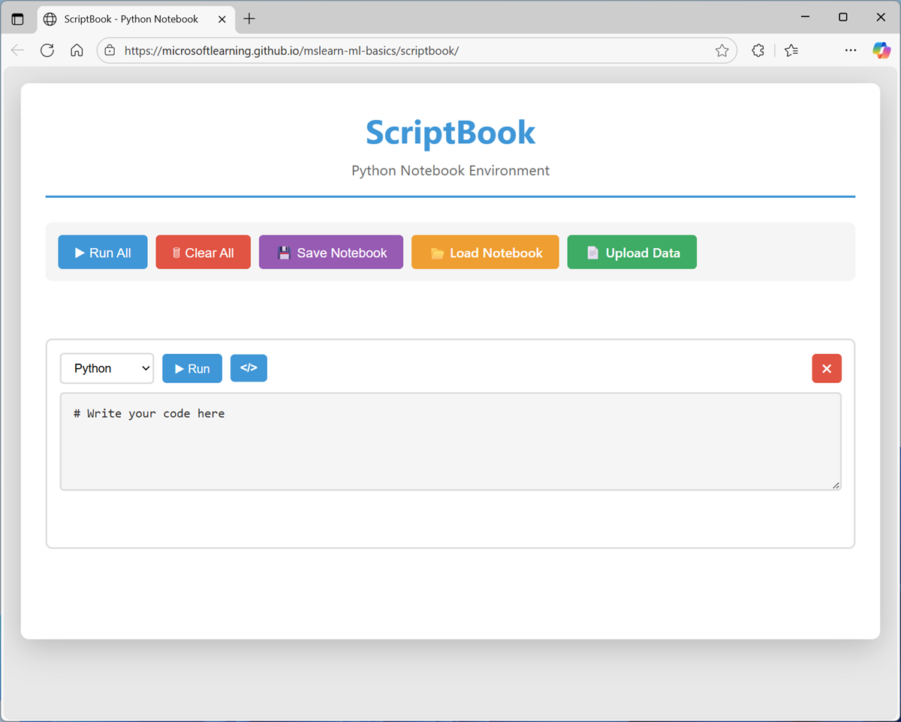

---
lab:
    title: 'Explore data distributions and comparisons'
    description: 'Explore data distributions and comparisons with Python'
---

# Explore data distributions and comparisons

In this exercise you will use a lightweight Python notebook to explore data distributions and techniques for comparing data with Python.

This exercise should take approximately **15** minutes to complete.

## Open and run the notebook for this exercise

The code for this exercise is provided in a Python notebook. The notebook is designed to be run in a lightweight notebook environment called *ScriptBook* that was built specifically for this training. 

> **Note**: The notebook editor runs locally in your browser, so there's no need to sign into any cloud services or install software on your computer. You just need a modern web browser, such as Microsoft Edge, with JavaScript enabled.

1. In your web browser, open the [ScriptBook](https://aka.ms/scriptbook){:target="_blank"} notebook tool at `https://aka.ms/scriptbook`.

    ScriptBook is a lightweight Python notebook editor that supports simple Python scripting in the browser.

    

1. In a new browser tab, open the [real-world-data.pysb](https://raw.githubusercontent.com/MicrosoftLearning/mslearn-ml-basics/refs/heads/main/Labfiles/real-world-data.pysb){:target="_blank"} notebook at `https://raw.githubusercontent.com/MicrosoftLearning/mslearn-ml-basics/refs/heads/main/Labfiles/real-world-data.pysb` and save it on your local computer - be sure to save it as as **real-world-data.pysb**, <u>not</u> *real-world-data.pysb.**txt***.
1. In ScriptBook, use the **Load Notebook** button to open the **real-world-data.pysb** notebook file you downloaded.
1. Follow the instructions in the notebook to run the Python code cells and review the outputs. Note that in some steps, you may need to upload data files to the notebook before running the Python code that processes them!
